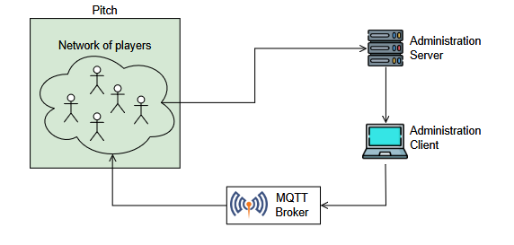

# WatchOut
Distributed and Pervasive Systems project that implements hide &amp; seek, implementing all the required concurrent data structures from scratch (using only java synchronized, notify, wait statements).
## Architecture

- Administration server: a server that offers REST API to register players and their health status, as well as query statistics about such status. Serves requests concurrently with multiple threads, so it needs to synchronize the access to the required data structures.
- Administration client: a client that allows the game manager to query the Administration Server to obtain information about the health status of participants. The Administration client is also in charge of notifying
the players via MQTT of the start of the game.
- Player: The process that runs on the smart watch of the player. It collects heart rate data from the sensor with the sliding window technique, sends it to the administration server, and implements the distributed game logic. Players communicate with one another with gRPC, deciding who will be the seeker with the bully algorithm (election), and who will access the home base with the Ricart-Agrawala algorithm (mutual exclusion). Since gRPC incoming messages are handled concurrently, proper synchronization to access player data structures is required. Additionally, players can enter the game at any time, posing an additional challenge. This is handled by implementing a phase state, that determines the behaviour of the player. When a new player enters the game, it presents itself to the other players, communicating their address, port, and coordinates on the field, also asking for the phase state. The new player waits for every response to be received, and the sets the phase state to the most advanced one received. This requires appropriate synchronization, to delay responses to new player when in critical sections of the code that cause a change of phase (like election).

For more the detailed specification read [this](https://github.com/DavVarr/WatchOut/blob/main/Project_DPS_2024___WatchOut.pdf)
## Installation and java version
The project is built with gradle. Java 11 is required.
